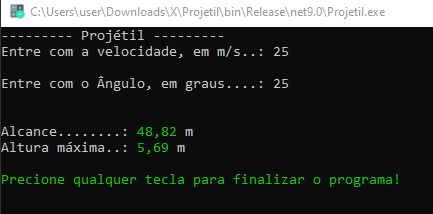

# Obrigado pelo projeto

Este software simula uma calculadora da equação de torricelli.

## _Screenshot_



## _Download_

Baixe o arquivo abaixo. Descompacxte na pasta desejada.

[🎁 Download do arquivo .zip](Dist/CalculaduraDaEquaçãoDeTorricelli.zip)

Execute utilizando o comando:

```
Dotnet Projetil.dll
```

Ou, se você estiver no Windows, pode dar um duplo-clique no ícone do programa.

## Agradecimentos

* [Etec](https://www.cps.sp.gov.br/etecs/etec-adolpho-berezin/)
* [Prof. Ermogenes](https://github.com/ermogenes)

---

Todos os direitos reservados. [PIRATARIA É CRIME]